# A Multi-Modal Haptic System for Vehicle Navigation

내비게이션 정보 전달을 위한 멀티 모달 햅틱 시스템

## Overview

---

 This study aims to explore the potential of haptic feedback in communicating complex navigation information to a driver’s rear neck. To achieve the goal, we propose a multi-modal haptic interface that provides navigation route information with a haptic rendering algorithm using vibrotactile actuator array and instantaneous alarm signal with cutaneous feedback mechanism. 

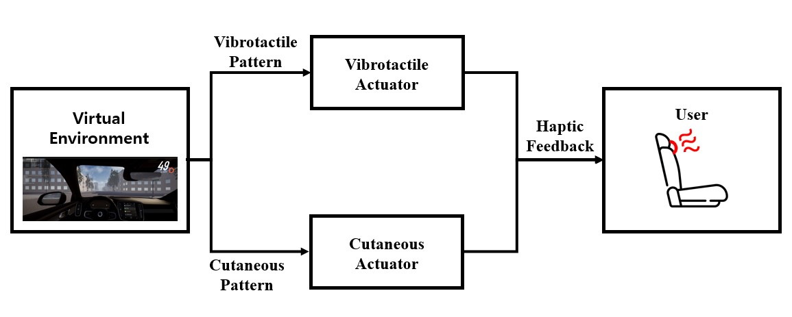

Architecture of the proposed haptic system

## Circuit **configuration**

---

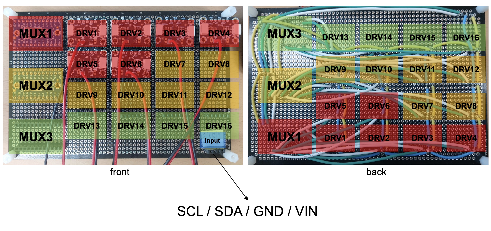

- I2C communication : Using SCL/SDA port to communicate with Arduino
- 5V input
- Use ports 1-6 of each multiplexer (because ports 0 and 7 are less reliable)

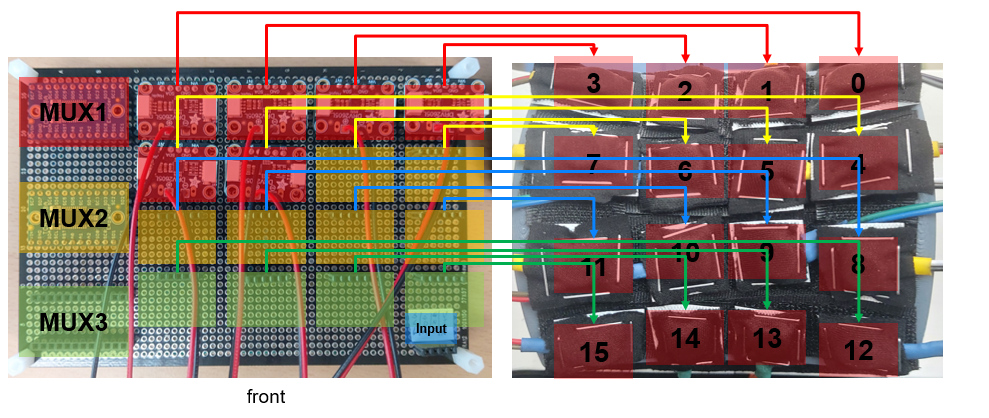
- + and - signal on the connection between DRV2605 and the actuator does not matter

## Arduino Code

---

### Parameters

```arduino
int mode = 1;
int duration = 60;
int splitNum = 30;
```

- duration is less than 69.55ms, because of moving tactile algorithm:

$$
SOA = 0.32 \cdot duration + 0.0473 ≥ duration
$$

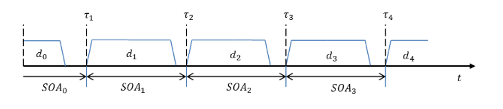

### Modifying Parameters

**Mode**

```arduino
case '0':
  mode = 0;
  Serial.println("Set mode 2x2");
  break;
case '1':
  mode = 1;
  Serial.println("Set mode 3x3");
  break;
case '2':
  mode = 2;
  Serial.println("Set mode 4x4");
  break;
```

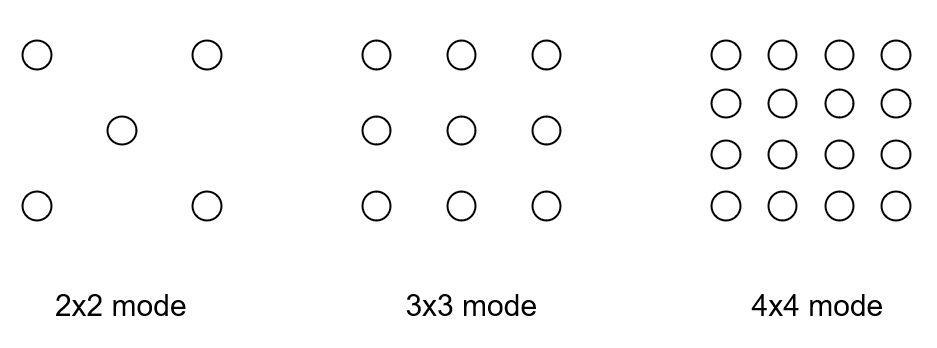

**Duration**

```arduino
case '+':
  duration += 10;
  Serial.print("Set duration ");
  Serial.println(duration);
  break;

case '-':
  duration -= 10;
  Serial.print("Set duration ");
  Serial.println(duration);
  break;
```

**SplitNum**

```arduino
case '*':
  splitNum += 10;
  Serial.print("Set number of stimuli ");
  Serial.println(splitNum);
  break;

case '/':
  splitNum -= 10;
  Serial.print("Set number of stimuli ");
  Serial.println(splitNum);
  break;
```

### Rendering Algorithm

### 1. Input values

```arduino
case 'a':
  for(int i=0; i<=splitNum; i++) {
    x = 0;
    y = -150+300*i/splitNum;
    tactileStroke(x, y);
  }
```

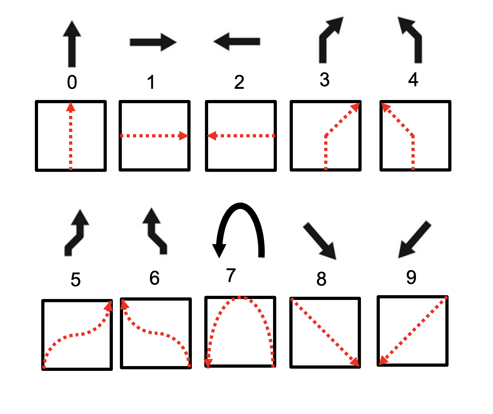

Example of Navigation sign

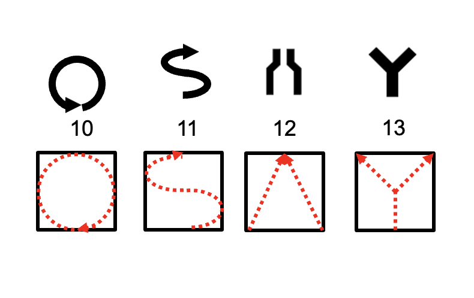

Example of Alert sign

### 2. Converting input values

Converting input values into coordinate values for each stimulus

### 3. Calculate distance

Calculate the distance from each actuator to the position you want to stimulate (target position).

```arduino
float calcDistance(float x, float y, int& d1Idx, int& d2Idx, int& d3Idx, float& d1, float& d2, float& d3, int mode) {
float d[16] = {0, };
int size; // capacity
int distanceMax;
float min1=1000, min2=1000, min3=1000;
int min1Idx, min2Idx, min3Idx;  // 가장 가까운 3점 배열에서의 index

// mode 0, 1, 2 -> 2x2, 3x3, 4x4
// (x,y)에서 9개의 점과의 거리 계산, d배열에 저장
switch (mode) {
case 0:
  size = 5;
  //distanceMax = 300; // 150*2
  for(int i=0; i<3; i+=2)
    for(int j=0; j<3; j+=2)
      d[i+j/2] = sqrt((x-150*(j-1))*(x-150*(j-1)) + (y+150*(i-1))*(y+150*(i-1)));
  d[4] = sqrt(x*x+y*y);
  break;

case 1:
  size = 9;
  //distanceMax = 212; // 150*sqrt(2)
  for(int i=0; i<3; i++)
    for(int j=0; j<3; j++)
      d[i*3+j] = sqrt((x-150*(j-1))*(x-150*(j-1)) + (y+150*(i-1))*(y+150*(i-1)));
  break;  

case 2:
  size = 16;
  //distanceMax = 300; // 100*sqrt(2)
  for(int i=0; i<4; i++)
    for(int j=0; j<4; j++)
      d[i*4+j] = sqrt((x+150-100*j)*(x+150-100*j) + (y-150+100*i)*(y-150+100*i));
  break;
}

// minimum 3 distances. min1 is lowest
for (int i = 0; i < size; i++) {
if (d[i] < min1) {
    min3 = min2;
    min3Idx = min2Idx;
    min2 = min1;
    min2Idx = min1Idx;
    min1 = d[i];
    min1Idx = i;
} else if (d[i] < min2) {
    min3 = min2;
    min3Idx = min2Idx;
    min2 = d[i];
    min2Idx = i;
} else if (d[i] < min3) {
    min3 = d[i];
    min3Idx = i;
}
}

d1Idx = arrIdxToActuatorIdx(min1Idx, mode);
d2Idx = arrIdxToActuatorIdx(min2Idx, mode);
d3Idx = arrIdxToActuatorIdx(min3Idx, mode);
d1 = min1; 
d2 = min2; 
d3 = min3;

// Check minimum 3 values
// Serial.print(d1); Serial.print("("); Serial.print(min1Idx); Serial.print("), ");
// Serial.print(d2); Serial.print("("); Serial.print(min2Idx); Serial.print("), ");
// Serial.print(d3); Serial.print("("); Serial.print(min3Idx); Serial.println(")  ");
}
```

- Distance should be calculated differently for each mode
- Find the smallest 3 distances and return the corresponding actuator and its distance.

### 4. Calculate intensity

Calculate the strength of the actuator by relying on the moving tactile stroke algorithm.

$$
A_i = \sqrt{\frac{1/d_i}{\sum^3_{j=1}1/d_j}}A_v
$$

```arduino
float calcIntensity(float d1, float d2, float d3) {
  if (d1 < 0)
    return 0;
  else if (d1 == 0)
    return 127;
  else
    return 127*sqrt((1/d1)/(1/d1+1/d2+1/d3));
}
```

- $d_i$ is the distance between target position (you want to stimulate) and actuator
- $A_v$ is the target intensity

### 5. **Rendering specific signals**

```arduino
void tactileStroke(float x, float y) {
  calcDistance(x, y, d1Idx, d2Idx, d3Idx, d1, d2, d3, mode);
  beginVibrate(d1Idx, calcIntensity(d1, d2, d3));
  beginVibrate(d2Idx, calcIntensity(d2, d1, d3));
  beginVibrate(d3Idx, calcIntensity(d3, d1, d2));
  delay(duration);
  endVibrate(d1Idx);
  endVibrate(d2Idx);
  endVibrate(d3Idx);
  delay(47.3-0.68*duration);
}
```

- Activate and deactivate three actuators simultaneously depending on duration and SOA

## Driving Virtual Environment (Unity)

---

Using Test Track, Logitech SDK Unity package.

Driving Virtual Environment send serial signals to microprocessor (Arduino)

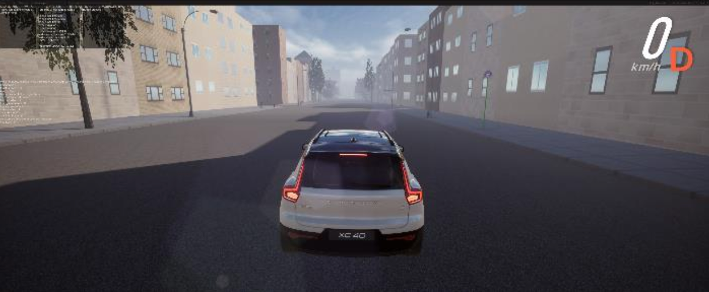

Third-person perspective of the driving simulation in virtual environment

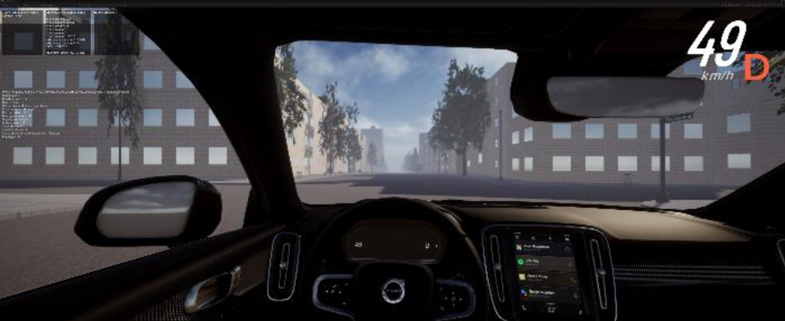

First-person perspective of the driving simulation in virtual environment

### Parameters (keys)

- C : change view
- R : reset position
- S : spring force
- D : damper force
- Left or Right Arrow : Side collision
- Up Arrow : Front collision
- I : Dirt road effect
- B : Bumpy road effect
- L : Slippery road effect
- **Space : start & stop record**
- Keypad (0~9) : Send Haptic pattern to Arduino

### Recording

Record time, steering wheel, break, activating signal in `report.csv` file.

- Time : (HH:MM:SS)
- Steering Wheel : -12767 ~ 12767
- Break : 0 ~ 32767
- Activating Signal : 0 ~ 9 signal

### Analyzing

```python
import matplotlib.pyplot as plt
import numpy as np
import csv

d = np.loadtxt('/content/report.csv', delimiter=',', dtype=str)

print (d)
print (d.dtype)

time = d[1:, 0]
steering_wheel = d[1:, 1].astype(int)
break_value = d[1:, 2].astype(int)
activating_signal = d[1:, 3].astype(int)

## 시간에 따른 Steering Wheel, Break 변화값
fig, ax1 = plt.subplots(figsize=(10, 5))

ax1.set_xlabel('Time')

# Plot the 'Steering Wheel' data on the primary y-axis
ax1.plot(time, steering_wheel, label='Steering Wheel', color='b')
ax1.set_ylabel('Steering Wheel', color='b')
ax1.tick_params(axis='y', labelcolor='b')

# Create a secondary y-axis
ax2 = ax1.twinx()

# Plot the 'Break' data on the secondary y-axis
ax2.plot(time, break_value, label='Break', color='r')
ax2.set_ylabel('Break', color='r')
ax2.tick_params(axis='y', labelcolor='r')

# Add a legend
lines, labels = ax1.get_legend_handles_labels()
lines2, labels2 = ax2.get_legend_handles_labels()
ax2.legend(lines + lines2, labels + labels2, loc='upper left')

# Rotate x-axis labels for better readability
# plt.xticks(rotation=45)
plt.tick_params(bottom = False)

# Show the plot
plt.title('Steering Wheel and Break values over Time')
plt.tight_layout()
plt.show()

## Signal에 따른 Steering Wheel 변화값
fig, ax1 = plt.subplots(figsize=(10, 5))

ax1.set_xlabel('Time')

# Plot the 'Steering Wheel' data on the primary y-axis
ax1.plot(time, steering_wheel, label='Steering Wheel', color='b')
ax1.set_ylabel('Steering Wheel', color='b')
ax1.tick_params(axis='y', labelcolor='b')

# Create a secondary y-axis
ax2 = ax1.twinx()

# Plot the 'Break' data on the secondary y-axis
ax2.plot(time, activating_signal, label='Activating Signal', color='r')
ax2.set_ylabel('Activating Signal', color='r')
ax2.tick_params(axis='y', labelcolor='r')

# Add a legend
lines, labels = ax1.get_legend_handles_labels()
lines2, labels2 = ax2.get_legend_handles_labels()
ax2.legend(lines + lines2, labels + labels2, loc='upper left')

# Rotate x-axis labels for better readability
plt.xticks(rotation=45)

# Show the plot
plt.title('Steering Wheel value according to the Signal change')
plt.tight_layout()
plt.show()

## Signal에 따른 Break 변화값
fig, ax1 = plt.subplots(figsize=(10, 5))

ax1.set_xlabel('Time')

# Plot the 'Steering Wheel' data on the primary y-axis
ax1.plot(time, break_value, label='Break', color='b')
ax1.set_ylabel('Break', color='b')
ax1.tick_params(axis='y', labelcolor='b')

# Create a secondary y-axis
ax2 = ax1.twinx()

# Plot the 'Break' data on the secondary y-axis
ax2.plot(time, activating_signal, label='Activating Signal', color='r')
ax2.set_ylabel('Activating Signal', color='r')
ax2.tick_params(axis='y', labelcolor='r')

# Add a legend
lines, labels = ax1.get_legend_handles_labels()
lines2, labels2 = ax2.get_legend_handles_labels()
ax2.legend(lines + lines2, labels + labels2, loc='upper left')

# Rotate x-axis labels for better readability
plt.xticks(rotation=45)

# Show the plot
plt.title('Break value according to the Signal change')
plt.tight_layout()
plt.show()
```

- Steering Wheel and Break values over Time

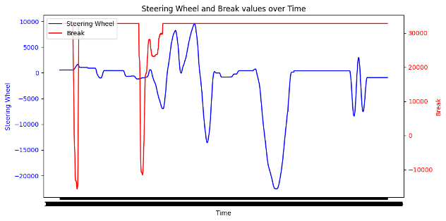

- Steering Wheel value according to the Signal change

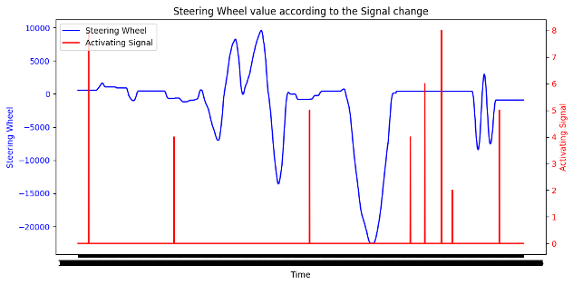

- Break value according to the Signal change

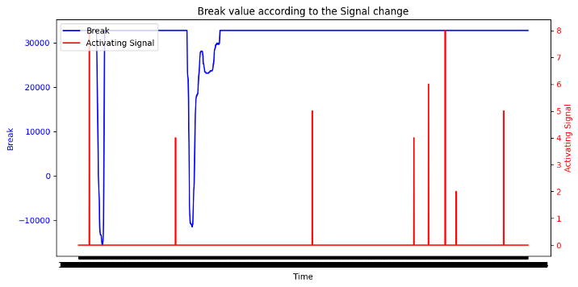
